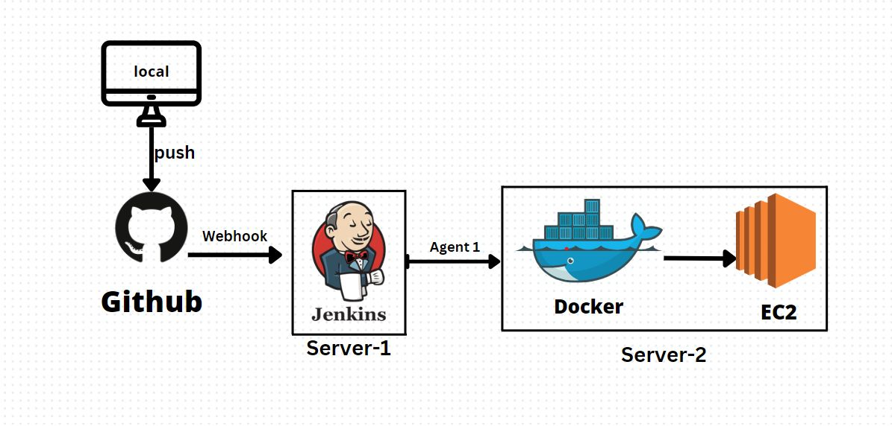

# django-todo
A simple todo app built with django


### Setup

You will need django to be installed in you computer to run this app. Head over to https://www.djangoproject.com/download/ for the download guide

Once you have downloaded django, go to the cloned repo directory and run the following command

```bash
$ python3 manage.py makemigrations
```

This will create all the migrations file (database migrations) required to run this App.

Now, to apply this migrations run the following command
```bash
$ python3 manage.py migrate
```

One last step and then our todo App will be live. We need to create an admin user to run this App. On the terminal, type the following command and provide username, password and email for the admin user
```bash
$ python3 manage.py createsuperuser
```

That was pretty simple, right? Now let's make the App live. We just need to start the server now and then we can start using our simple todo App. Start the server by following command

```bash
$ python3 manage.py runserver
```

Once the server is hosted, head over to http://127.0.0.1:8000/todos for the App.

To build docker image from Dockerfile

```bash
$ docker build -t image_name:tag .
```
To run docker image
```bash
docker run -d -p 8000:8000 image_name:tag
```

Cheers and Happy Coding :)
